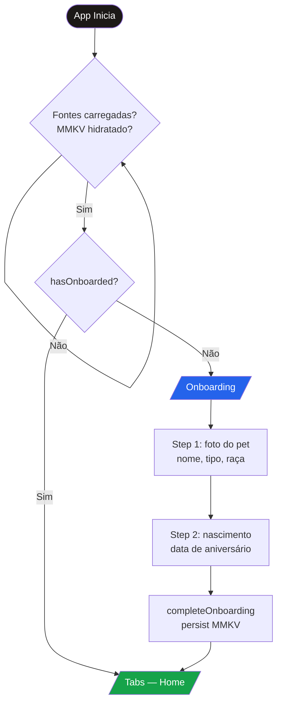
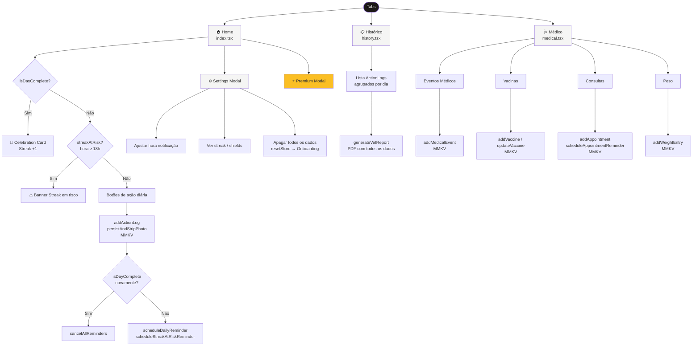
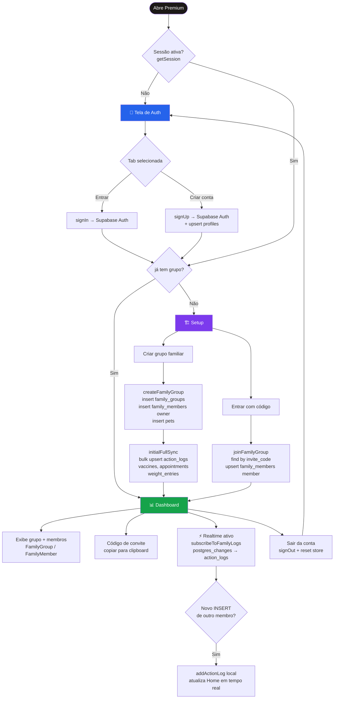
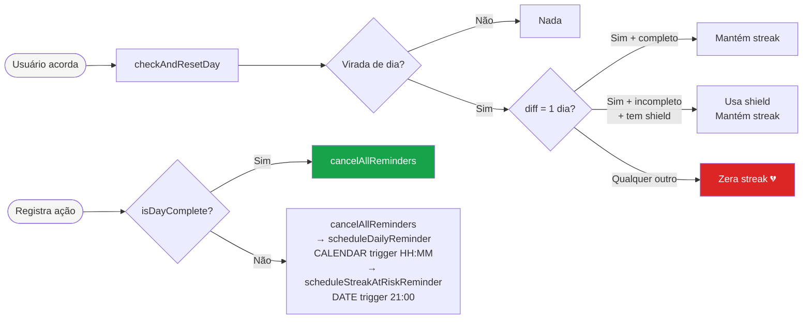
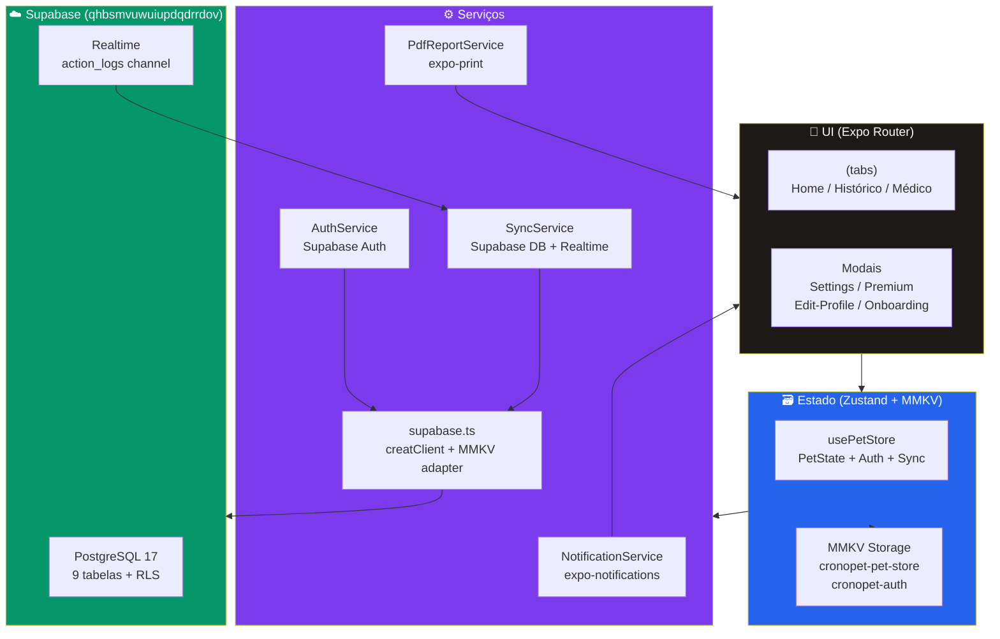

# CronoPet — Diagramas do Projeto

---

## 1. MER — Modelo Entidade-Relacionamento (Conceitual)

> Visão de alto nível: entidades do domínio e suas relações, sem se preocupar com tipos ou chaves.

```mermaid
erDiagram
    USUARIO {
        id          "identificador único"
        email       "e-mail de autenticação"
        nome        "nome de exibição"
    }

    GRUPO_FAMILIAR {
        id          "identificador único"
        nome        "nome do grupo"
        invite_code "código de convite (8 chars)"
    }

    PET {
        nome        "nome do animal"
        tipo        "cachorro / gato / outro"
        raca        "raça (opcional)"
        foto        "URI da foto"
        nascimento  "data de nascimento"
    }

    REGISTRO_ACAO {
        id        "identificador único"
        chave     "comida/agua/passeio/xixi/coco/banho"
        timestamp "momento do registro"
        nota      "observação livre"
    }

    EVENTO_MEDICO {
        id        "identificador único"
        tipo      "vomito/febre/mancando/..."
        timestamp "momento do evento"
        nota      "observação livre"
    }

    VACINA {
        id          "identificador único"
        nome        "nome da vacina"
        data        "data de aplicação"
        proxima     "data da próxima dose"
        veterinario "nome do veterinário"
        lote        "número do lote"
    }

    CONSULTA {
        id          "identificador único"
        titulo      "título da consulta"
        data        "data"
        hora        "horário"
        veterinario "nome do veterinário"
    }

    HISTORICO_PESO {
        id   "identificador único"
        peso "peso em kg"
        data "data da pesagem"
    }

    USUARIO            ||--||    USUARIO           : "tem perfil próprio"
    USUARIO            }o--o{    GRUPO_FAMILIAR     : "é membro de"
    GRUPO_FAMILIAR     ||--o{    USUARIO            : "tem membros"
    GRUPO_FAMILIAR     ||--||    PET                : "possui exatamente 1 pet"
    GRUPO_FAMILIAR     ||--o{    REGISTRO_ACAO      : "agrupa registros de"
    GRUPO_FAMILIAR     ||--o{    EVENTO_MEDICO      : "agrupa eventos de"
    GRUPO_FAMILIAR     ||--o{    VACINA             : "armazena vacinas de"
    GRUPO_FAMILIAR     ||--o{    CONSULTA           : "agenda consultas de"
    GRUPO_FAMILIAR     ||--o{    HISTORICO_PESO     : "registra peso de"
    USUARIO            ||--o{    REGISTRO_ACAO      : "autor de"
    USUARIO            ||--o{    EVENTO_MEDICO      : "autor de"
```

---

## 2. DER — Diagrama Entidade-Relacionamento (Físico/Lógico)

> Mapeamento 1:1 com o schema Supabase: todas as colunas, tipos, PKs e FKs.

```mermaid
erDiagram

    AUTH_USERS {
        uuid        id          PK
        text        email
        timestamptz created_at
    }

    PROFILES {
        uuid        id          PK  "FK → auth.users.id"
        text        email       "NOT NULL"
        text        nome
        timestamptz created_at
    }

    FAMILY_GROUPS {
        uuid        id          PK  "gen_random_uuid()"
        text        nome        "NOT NULL"
        text        invite_code "UNIQUE, auto-gerado (trigger)"
        uuid        owner_id    FK  "→ profiles.id"
        timestamptz created_at
    }

    FAMILY_MEMBERS {
        uuid        group_id    PK,FK "→ family_groups.id"
        uuid        user_id     PK,FK "→ profiles.id"
        text        role        "owner | member"
        timestamptz joined_at
    }

    PETS {
        uuid        group_id    PK,FK "→ family_groups.id  (1 pet por grupo)"
        text        nome        "NOT NULL"
        text        tipo        "cachorro | gato | outro"
        text        raca
        text        foto_url
        date        nascimento
        timestamptz updated_at
    }

    ACTION_LOGS {
        text        id          PK  "timestamp-random"
        uuid        group_id    FK  "→ family_groups.id"
        uuid        user_id     FK  "→ profiles.id"
        text        key         "NOT NULL  (comida/agua/...)"
        bigint      timestamp   "NOT NULL  (epoch ms)"
        text        note
        timestamptz synced_at
    }

    MEDICAL_EVENTS {
        text        id          PK
        uuid        group_id    FK  "→ family_groups.id"
        uuid        user_id     FK  "→ profiles.id"
        text        type        "NOT NULL"
        bigint      timestamp   "NOT NULL"
        text        note
        timestamptz synced_at
    }

    VACCINES {
        text        id          PK
        uuid        group_id    FK  "→ family_groups.id"
        text        nome        "NOT NULL"
        date        data        "NOT NULL"
        date        proxima
        text        veterinario
        text        lote
        text        nota
        timestamptz synced_at
    }

    APPOINTMENTS {
        text        id          PK
        uuid        group_id    FK  "→ family_groups.id"
        text        titulo      "NOT NULL"
        date        data        "NOT NULL"
        time        hora
        text        veterinario
        text        nota
        timestamptz synced_at
    }

    WEIGHT_ENTRIES {
        text        id          PK
        uuid        group_id    FK  "→ family_groups.id"
        numeric     peso        "NOT NULL  (5,2)"
        date        data        "NOT NULL"
        text        nota
        timestamptz synced_at
    }

    AUTH_USERS         ||--||    PROFILES        : "id (cascade delete)"
    PROFILES           ||--o{    FAMILY_GROUPS   : "owner_id"
    PROFILES           }o--o{    FAMILY_MEMBERS  : "user_id"
    FAMILY_GROUPS      ||--o{    FAMILY_MEMBERS  : "group_id"
    FAMILY_GROUPS      ||--||    PETS            : "group_id (1-to-1)"
    FAMILY_GROUPS      ||--o{    ACTION_LOGS     : "group_id"
    FAMILY_GROUPS      ||--o{    MEDICAL_EVENTS  : "group_id"
    FAMILY_GROUPS      ||--o{    VACCINES        : "group_id"
    FAMILY_GROUPS      ||--o{    APPOINTMENTS    : "group_id"
    FAMILY_GROUPS      ||--o{    WEIGHT_ENTRIES  : "group_id"
    PROFILES           ||--o{    ACTION_LOGS     : "user_id"
    PROFILES           ||--o{    MEDICAL_EVENTS  : "user_id"
```



---

## 3. Fluxograma — Navegação e Fluxo de Dados

### 3a. Inicialização e Roteamento



### 3b. Fluxo Principal — Tabs



### 3c. Fluxo Premium — Compartilhamento Familiar



### 3d. Fluxo de Notificações



---

## Resumo da Arquitetura


