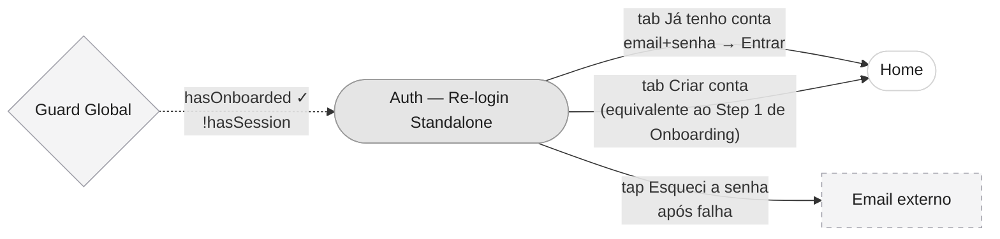
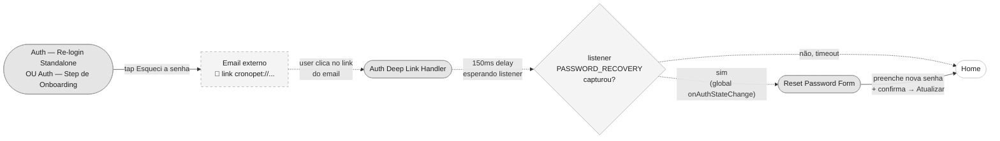
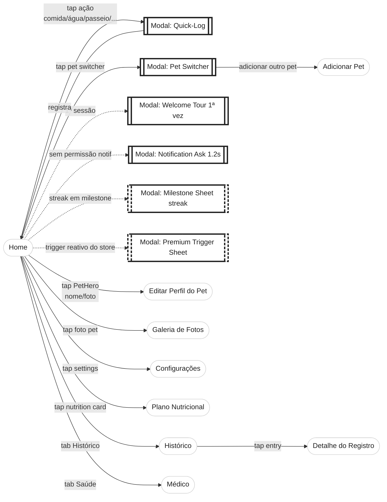
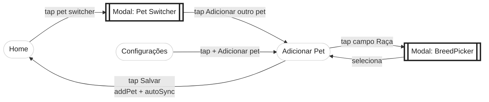
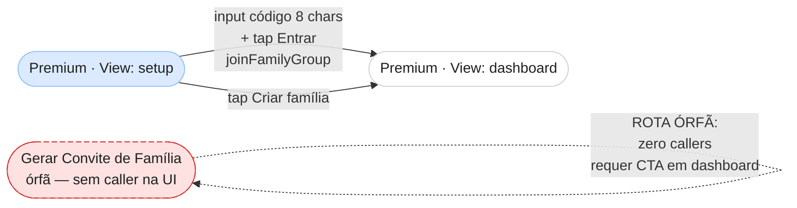
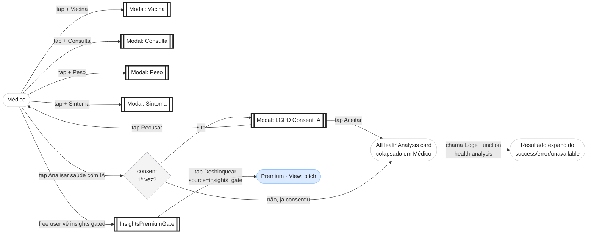
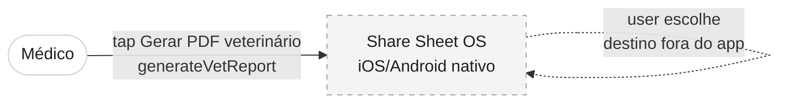

# Artefato 1 — User Flow Diagram

**Notação:** User Flow Diagram (Garrett / NN/g)
**Audiência:** CMO, CEO, designer terceirizado, devs futuros
**Pergunta que responde:** Como o usuário navega pelo CronoPet, quais ações disparam transições de tela, e onde estão os pontos de bifurcação e os gates (auth, premium, onboarding)
**Renderização:** este arquivo no GitHub renderiza Mermaid nativamente. Para apresentação tela-cheia, copiar bloco individual em https://mermaid.live
**Última atualização:** 2026-06-02
**Commit:** (este arquivo é parte do commit que o cria; hash em `git log -- docs/diagrams/01-user-flow.md`)
**Status:** approved

---

## Convenções

### Formas (mermaid)

| Sintaxe | Significado |
|---|---|
| `([Nome])` | Tela do app (retângulo arredondado) |
| `[[Nome]]` | Modal ou bottom sheet (retângulo de borda dupla) |
| `{Decisão?}` | Decisão do usuário (diamante) |
| `[Nome]` | Sistema externo (envelope/loja/popup OS) |

### Cores semânticas (canal redundante — todo nó sempre tem label textual)

| Categoria | Fill | Stroke | Quando |
|---|---|---|---|
| **Auth** | `#E5E5E5` | `#999999` | Login, signup, reset, deep link handler |
| **Main** | `#FFFFFF` | `#D4D4D4` | Telas principais pós-auth (Home, Histórico, Médico, etc.) |
| **Paywall** | `#DBEAFE` | `#93C5FD` | Premium gate (pitch, auth pra Pro, setup family group) |
| **Onboarding** | `#FEF3C7` | `#FCD34D` | 4 steps de cadastro inicial |
| **Externo** | `#F4F4F5` | `#A1A1AA` (tracejado) | Email, Apple StoreKit, etc. |

### Setas

- `-->` Ação do usuário (label descreve a ação concreta: "tap em X", "preenche e envia")
- `-.->` Transição automática (sem ação direta do usuário — guard global, timeout, listener)

### Tags textuais

- **`[reativo]`** — modal disparado pelo sistema, não por tap (só `PremiumTriggerSheet`)
- **`[órfão]`** — rota implementada mas sem caller acessível pela UI (só `app/invite.tsx`)

### Decisões de notação canônica

1. **`Premium · View: dashboard` renderizada em branco (categoria main)**, não azul claro (paywall). Razão: cor reflete experiência do usuário, não arquitetura de código — dashboard pós-conversão NÃO é paywall.
2. **Estados condicionais de Home** (free vs premium) tratados como **anotação lateral**, não nós separados. Mesmas ações disponíveis; só muda visibilidade do upgrade card.
3. **Sandbox (`/(dev)/sandbox`) excluído** — rota de desenvolvimento, não jornada de produção.
4. **Steps internos de Onboarding e Views internas de Premium são nós separados**, não sub-componentes — full-screen replace; tutor não-técnico não consegue distinguir "view interna" de "rota" e o briefing pede legibilidade pra não-técnico.
5. **Modais inline com tag `[reativo]` quando disparados pelo sistema** — visualmente é o mesmo shape de modal por tap; tag textual diferencia origem.

### Naming canônico (referência para Artefatos 2 e 3)

| Arquivo / Sub-vista | Nome canônico no diagrama |
|---|---|
| `app/onboarding.tsx` displayStep 0..3 | `Onboarding · Step 0/1/2/3` |
| `app/auth.tsx` | `Auth — Re-login Standalone` |
| `StepAuth` dentro do onboarding | `Auth — Step de Onboarding` |
| `app/auth/confirmed.tsx` | `Auth Deep Link Handler` |
| `app/auth/reset-password.tsx` | `Reset Password Form` |
| `app/premium.tsx` view='pitch' | `Premium · View: pitch` |
| `app/premium.tsx` view='auth' | `Premium · View: auth` |
| `app/premium.tsx` view='setup' | `Premium · View: setup` |
| `app/premium.tsx` view='dashboard' | `Premium · View: dashboard` (branco/main) |
| `app/(tabs)/index.tsx` | `Home` |
| `app/(tabs)/history.tsx` | `Histórico` |
| `app/(tabs)/medical.tsx` | `Médico` |
| `app/photos.tsx` | `Galeria de Fotos` |
| `app/log-detail.tsx` | `Detalhe do Registro` |
| `app/edit-profile.tsx` | `Editar Perfil do Pet` |
| `app/nutrition.tsx` | `Plano Nutricional` |
| `app/add-pet.tsx` | `Adicionar Pet` |
| `app/settings.tsx` | `Configurações` |
| `app/invite.tsx` | `Gerar Convite de Família [órfã]` |

---

## Jornada 1 — Primeiro Acesso

**Persona:** Tutor novo, instalou o app pela loja
**Pré-condição:** MMKV vazio, sem session, `hasOnboarded = false`
**Resultado esperado:** Tutor logado com 1 pet cadastrado em Home

```mermaid
flowchart LR
    SP([Cold Start]):::auto
    G{Guard Global}:::auto
    O0([Onboarding · Step 0<br/>Welcome]):::onb
    O1([Onboarding · Step 1<br/>Auth — Step de Onboarding]):::onb
    O2([Onboarding · Step 2<br/>Pet Type]):::onb
    O3([Onboarding · Step 3<br/>Pet Profile]):::onb
    BR[[Modal: BreedPicker]]:::modal
    H([Home]):::main

    SP -.->|hidratação MMKV| G
    G -.->|!hasOnboarded| O0
    O0 -->|tap Começar| O1
    O1 -->|preenche e envia| O2
    O1 -->|signin existente: hidrata cloud| H
    O2 -->|seleciona tipo| O3
    O3 -->|tap raça| BR
    BR -->|seleciona ou Outro| O3
    O3 -->|tap Começar agora| H

    classDef onb fill:#FEF3C7,stroke:#FCD34D,color:#1F1F1F
    classDef main fill:#FFFFFF,stroke:#D4D4D4,color:#1F1F1F
    classDef auto fill:#F4F4F5,stroke:#A1A1AA,color:#1F1F1F
    classDef modal fill:#FFFFFF,stroke:#1F1F1F,stroke-width:3px,color:#1F1F1F
```

**Estados condicionais relevantes:**
- Em Step 1, se signin detecta pet pré-existente no cloud (`hadCloudPet = true`), pula Step 2/3 e vai direto pra Home (linha `app/onboarding.tsx:197`).
- Em Step 1, após **falha** de login, dois CTAs adicionais aparecem: "Reenviar confirmação" e "Esqueci a senha" (este último abre Jornada 3).

---

## Jornada 2 — Re-login Standalone

**Persona:** Tutor logado previamente, mas sessão expirou ou fez logout
**Pré-condição:** `hasOnboarded = true`, `hasSession = false`
**Resultado esperado:** Home (sessão válida)

**Notas:**
- `app/auth.tsx` reutiliza o componente `StepAuth` do onboarding. Comportamento visual idêntico ao Step 1, mas em rota separada.
- Sem ação de "voltar" (não há para onde voltar — o guard global trouxe o user pra cá).

---

## Jornada 3 — Recuperação de Senha

**Persona:** Tutor que esqueceu senha
**Pré-condição:** Conta existe, em `Auth — Re-login Standalone` OU `Auth — Step de Onboarding`
**Resultado esperado:** Senha atualizada + sessão válida em Home

**Nota técnica:** o delay de 150ms em `Auth Deep Link Handler` (`app/auth/confirmed.tsx`) dá 1 frame pro listener global em `app/_layout.tsx` capturar o evento `PASSWORD_RECOVERY` e desviar pra `Reset Password Form` antes do redirect default pra Home.

---

## Jornada 4 — Uso Diário

**Persona:** Tutor com pet cadastrado, hábito de registrar rotina
**Pré-condição:** Home
**Resultado esperado:** Ação registrada, streak atualizado

**Estados condicionais de Home (anotação lateral):**
- **Estado free** (`!isPremium`): card de upgrade visível em `app/(tabs)/index.tsx:1062` (rotea pra `Premium · View: pitch`).
- **Estado premium** (`isPremium`): card oculto, conteúdo redistribuído.

**Tag `[reativo]`** distingue modais disparados pelo sistema (Milestone Sheet, Premium Trigger Sheet) de modais disparados por tap (Quick-Log, Pet Switcher, etc.). Visualmente: borda dupla tracejada vs borda dupla sólida.

---

## Jornada 5 — Conversão pra Premium

**Persona:** Free user que viu valor no app
**Pré-condição:** Home, Médico ou modal reativo
**Resultado esperado:** Premium ativo (trial iniciado ou compra confirmada)

```mermaid
flowchart LR
    H([Home]):::main
    PTS[[Modal: Premium Trigger Sheet]]:::modalReativo
    IPG[[InsightsPremiumGate em Médico]]:::modal
    PV1([Premium · View: pitch]):::paywall
    PV2([Premium · View: auth]):::paywall
    PV3([Premium · View: setup]):::paywall
    PV4([Premium · View: dashboard]):::main
    ASK[Apple StoreKit · popup nativo OS]:::ext

    H -->|tap upgrade card<br/>source=home_upgrade_card| PV1
    PTS -->|tap CTA<br/>source=premium_trigger_sheet| PV1
    IPG -->|tap Desbloquear<br/>source=insights_gate| PV1
    PV1 -->|tap Começar 7 dias grátis| PV2
    PV2 -->|signup ou signin<br/>com sucesso| PV3
    PV2 -->|signup ou signin<br/>family group já existe| PV4
    PV3 -->|tap Criar família<br/>OU input código + Entrar| PV4
    PV4 -->|tap Assinar mensal/anual| ASK
    ASK -.->|sucesso| PV4
    ASK -.->|cancelado| PV4

    classDef main fill:#FFFFFF,stroke:#D4D4D4,color:#1F1F1F
    classDef paywall fill:#DBEAFE,stroke:#93C5FD,color:#1F1F1F
    classDef modal fill:#FFFFFF,stroke:#1F1F1F,stroke-width:3px,color:#1F1F1F
    classDef modalReativo fill:#FFFFFF,stroke:#1F1F1F,stroke-width:3px,stroke-dasharray:6 3,color:#1F1F1F
    classDef ext fill:#F4F4F5,stroke:#A1A1AA,stroke-dasharray:5 5,color:#1F1F1F
```

**Sources de paywall canônicos (PaywallSource enum em `services/analytics.ts:28-36`):**

| Source | Estado |
|---|---|
| `home_upgrade_card` | ✅ implementado (`(tabs)/index.tsx:1062`) |
| `premium_trigger_sheet` | ✅ implementado (`components/ui/PremiumTriggerSheet.tsx:135`) |
| `insights_gate` | ✅ implementado (`components/home/InsightsPremiumGate.tsx:43`) |
| `settings_upgrade_card` | ❌ GAP — sem caller |
| `history_lock` | ❌ GAP — sem caller |
| `family_invite` | ❌ GAP — sem caller |
| `sync_promo` | ❌ GAP — sem caller |
| `onboarding` | ❌ GAP — sem caller |
| `other` | ✅ catch-all (fallback em `app/premium.tsx:147`) |

---

## Jornada 6 — Adicionar Pet Adicional

**Persona:** Tutor com 1+ pet querendo cadastrar outro
**Pré-condição:** Home OU Configurações
**Resultado esperado:** Novo pet ativo

**Após salvar:** o novo pet vira `activePetId` automaticamente; Home re-renderiza com o novo pet.

---

## Jornada 7 — Family Sharing (parcialmente implementada)

**Status:** JOIN funciona via `/premium`; INVITE existe como rota órfã.

**LACUNA EXPLÍCITA:** `app/invite.tsx` está totalmente implementada (gera código cripto, copia, share sheet via `expo-sharing`) mas **zero callers** pelo grep. Considerar adicionar CTA em `Premium · View: dashboard` ou descontinuar a rota.

---

## Jornada 8 — Análise de Saúde com IA

**Persona:** Tutor curioso/preocupado
**Pré-condição:** Médico
**Resultado esperado:** Resultado de análise OU "indisponível" educado

**Nota:** `AIHealthAnalysis` em si **não tem premium gate** — o gate é LGPD opt-in. O premium gate é separado: `InsightsPremiumGate` é o card de "insights de saúde" no card próprio de Médico, que sim leva pro paywall com source `insights_gate`.

---

## Jornada 9 — Geração de Relatório PDF

**Status:** NÃO é jornada de tela — é ação dentro de Médico.

`generateVetReport` em `services/PdfReportService.ts` chama `expo-sharing` — a partir daqui o fluxo é do sistema operacional, fora do escopo do app.

---

## Modais inline — Card de Referência

Todos os modais são **inline**, vivem em telas hospedeiras (não são rotas).

| Modal | Hospedeira | Trigger | Tag |
|---|---|---|---|
| Quick-Log | Home | tap ação | tap |
| Pet Switcher | Home | tap pet switcher | tap |
| Welcome Tour | Home | 1ª sessão | reativo (1ª vez) |
| Notification Ask | Home | 1.2s sem permissão | reativo |
| Milestone Sheet | Home | streak em [7,14,30,60,100,365] | reativo |
| Premium Trigger Sheet | Home | `pendingTrigger` no store + 4s | reativo |
| Vacina | Médico | tap + Vacina | tap |
| Consulta | Médico | tap + Consulta | tap |
| Peso | Médico | tap + Peso | tap |
| Sintoma | Médico | tap + Sintoma | tap |
| LGPD Consent IA | Médico (em AIHealthAnalysis) | tap Analisar saúde 1ª vez | tap |
| BreedPicker | Onboarding Step 3, Add Pet, Edit Profile | tap campo Raça | tap |

---

## Lacunas Conhecidas

1. **`app/invite.tsx` é rota órfã (zero callers)**. Tela implementada com geração de código + share, mas inacessível pela UI. Considerar adicionar CTA em `Premium · View: dashboard` ou descontinuar.

2. **6 dos 9 paywall sources canônicos do enum `PaywallSource` não têm caller no código:** `settings_upgrade_card`, `history_lock`, `family_invite`, `sync_promo`, `onboarding`, `other` (este último é catch-all aceitável). **Input direto pra backlog pós-launch**, especialmente para o Artefato 2 (Conversion Funnel) onde isso vira tags `GAP`.

3. **Family Sharing parcialmente implementado.** JOIN funciona via `Premium · View: setup`; INVITE (`/invite`) é órfã. Cobre-se o fluxo possível, mas com aviso visual.

4. **`/(dev)/sandbox` excluída** — rota de desenvolvimento, isolada do guard global via `inDev`. Não é jornada de produção.

5. **`/+not-found.tsx` e `/+html.tsx` não cobertos** — primeiro é fallback automático do Expo Router; segundo é wrapper web (app é mobile-first).

6. **Modal `LGPD Consent IA` aparece apenas na 1ª chamada do AIHealthAnalysis**; nas chamadas seguintes, `aiConsentGiven` no store evita re-prompt. Documentado em Jornada 8.

7. **Modais de Médico (Vacina, Consulta, Peso, Sintoma)** são representados como nós únicos sem detalhar o sub-formulário interno. Razão: cada um é form simples sem bifurcação; expandir multiplicaria a complexidade visual sem ganho informacional pro tutor não-técnico.

8. **Apple StoreKit popup nativo** é mostrado como nó externo. Suas sub-telas (Touch ID, confirmação de senha Apple ID, etc.) são responsabilidade do sistema operacional, fora do escopo do app.
