# Artefato 2 — Conversion Funnel com Benchmarks

**Notação:** Conversion Funnel vertical (padrão Mixpanel / Amplitude / RevenueCat State of Subscription Apps)
**Audiência:** CTO, CEO (leitura estratégica), CMO (pontos de atuação de marketing)
**Pergunta que responde:** Onde está o funil de conversão do CronoPet, quais eventos PostHog medem cada etapa, quais benchmarks da indústria se aplicam, e onde estão os gaps de instrumentação
**Renderização:** este arquivo no GitHub renderiza Mermaid nativamente. Para apresentação tela-cheia, copiar bloco individual em https://mermaid.live
**Última atualização:** 2026-06-02
**Commit:** (este arquivo é parte do commit que o cria; hash em `git log -- docs/diagrams/02-conversion-funnel.md`)
**Status:** approved

---

## Convenções

### Cores semânticas (acompanham label)

| Categoria | Etapas | Cor |
|---|---|---|
| **Aquisição** | 1–3 (install → onboarding iniciado) | Verde `#D1FAE5` / stroke `#10B981` |
| **Ativação** | 4–7 (onboarding completo → D7 retention) | Amarelo `#FEF3C7` / stroke `#F59E0B` |
| **Monetização** | 8–12 (paywall → trial convertido) | Azul `#DBEAFE` / stroke `#3B82F6` |

### Tags textuais inline

| Tag | Significado |
|---|---|
| `[GAP]` | Etapa não rastreável via PostHog ou source não-implementado |
| `[SERVER]` | Evento emitido server-side via Edge Function (não cliente) |
| `[DERIVED]` | Métrica derivada via PostHog Retention/Cohort, sem evento próprio |
| `[POSSIBLE_DUP]` | Evento disparado em múltiplos lugares — risco de duplicação |

### Nota técnica sobre PostHog RN SDK

O PostHog SDK no React Native **não** emite eventos como `$app_opened` automaticamente — diferente do web SDK. Todo evento deste funil é **manual**, com origem confirmada no código. Mesmo o `app_opened` (Etapa 2) é trackeado em `app/_layout.tsx:164` na useEffect de bootstrap, com prop `coldStart` distinguindo abertura após kill do app vs retorno do background.

### Decisão sobre benchmarks (proxy)

Benchmarks específicos para **pet apps** não estão publicados de forma confiável. Este funil usa **mobile freemium consumer apps** como proxy. Fontes citadas (Adjust 2024, Mixpanel 2023, Amplitude 2024, RevenueCat 2024) são canônicas pra categoria; aplicabilidade direta a pet care é estimativa. Se relatórios específicos de pet care emergirem, atualizar.

---

## Funil

```mermaid
flowchart TB
  E1["<b>Etapa 1 · AQUISIÇÃO (Install)</b><br/>Evento: <b>[GAP]</b> — não rastreável via PostHog<br/>Tracked: ASC Analytics (fora do app)<br/>Benchmark: depende de canal (orgânico/paid)"]:::acq
  E2["<b>Etapa 2 · PRIMEIRA ABERTURA</b><br/>Evento: app_opened { coldStart }<br/>Tracked: app/_layout.tsx:164 (manual)<br/>Benchmark: 80–90% (Adjust 2024)"]:::acq
  E3["<b>Etapa 3 · ONBOARDING INICIADO</b><br/>Evento: onboarding_started<br/>Tracked: app/onboarding.tsx:58<br/>Benchmark: ~95% (fluxo default via guard)"]:::acq
  E4["<b>Etapa 4 · ONBOARDING COMPLETADO</b><br/>Evento: onboarding_completed { petType, hasPhoto, hasBirthdate }<br/>Tracked: store/usePetStore.ts:997<br/>Benchmark: 40–60% (Mixpanel 2023)"]:::act
  E5["<b>Etapa 5 · PRIMEIRO PET ADICIONADO</b><br/>Evento: first_pet_added { source: 'onboarding'/'manual' }<br/>Tracked: store/usePetStore.ts:902 (flag wasEmpty)<br/>Benchmark: ~100% (obrigatório no Step 3)"]:::act
  E6["<b>Etapa 6 · PRIMEIRA AÇÃO LOGADA</b><br/>Evento: first_action_logged { actionKey, daysSinceOnboarding }<br/>Tracked: store/usePetStore.ts:684<br/>Benchmark: 60–75% (Amplitude 2024)"]:::act
  E7["<b>Etapa 7 · RETENÇÃO D7</b> <b>[DERIVED]</b><br/>Evento: derivado de app_opened<br/>Tracked: PostHog Retention/Cohort (não-código)<br/>Benchmark: 20–35% (mobile freemium average)"]:::act
  E8["<b>Etapa 8 · PAYWALL VISTO</b><br/>Evento: paywall_viewed { source: PaywallSource }<br/>Tracked: app/premium.tsx:151 (3 sources OK · 6 <b>[GAP]</b>)<br/>Benchmark: variável (depende do gating)"]:::mon
  E9["<b>Etapa 9 · COMPRA INICIADA</b><br/>Evento: premium_purchase_started { plan }<br/>Tracked: services/purchases.ts:232<br/>Benchmark: 3–7% (RevenueCat 2024)"]:::mon
  E10["<b>Etapa 10 · COMPRA COMPLETADA</b> <b>[POSSIBLE_DUP]</b><br/>Evento: premium_purchase_completed { plan }<br/>Tracked: purchases.ts:245, :264 + usePetStore.ts:1136<br/>Benchmark: ~95% (StoreKit baixo abandono)"]:::mon
  E11["<b>Etapa 11 · TRIAL EM ANDAMENTO</b><br/>Evento: trial_started { plan }<br/>Tracked: services/purchases.ts:246/270 (se isInTrial)<br/>Benchmark: 60–80% concluem trial (RevenueCat 2024)"]:::mon
  E12["<b>Etapa 12 · TRIAL CONVERTIDO</b> <b>[SERVER]</b><br/>Evento: trial_converted { plan }<br/>Tracked: revenuecat-webhook/index.ts:387 (fire-and-forget, timeout 2s)<br/>Benchmark: 30–50% (RevenueCat 2024)"]:::mon

  E1 -->|"80–90% installs abrem"| E2
  E2 -->|"~95% chegam ao onboarding"| E3
  E3 -->|"40–60% completam"| E4
  E4 -->|"~100% (obrigatório)"| E5
  E5 -->|"60–75% logam 1ª ação"| E6
  E6 -->|"20–35% voltam em D7"| E7
  E7 -.->|"% paywall views<br/>(vários caminhos, variável)"| E8
  E8 -->|"3–7% iniciam compra"| E9
  E9 -->|"~95% completam"| E10
  E10 -->|"100% (mesmo evento)"| E11
  E11 -->|"60–80% concluem trial · 30–50% conversão final"| E12

  classDef acq fill:#D1FAE5,stroke:#10B981,color:#064E3B
  classDef act fill:#FEF3C7,stroke:#F59E0B,color:#78350F
  classDef mon fill:#DBEAFE,stroke:#3B82F6,color:#1E3A8A
```

---

## Paywall Sources Breakdown (Etapa 8)

O evento `paywall_viewed` recebe `source: PaywallSource` (enum em `services/analytics.ts:28-37`) com 9 valores possíveis. Análise de cobertura:

| Source canônico | Status | Caller real |
|---|---|---|
| `home_upgrade_card` | ✅ | `app/(tabs)/index.tsx:1062` |
| `premium_trigger_sheet` | ✅ | `components/ui/PremiumTriggerSheet.tsx:135` |
| `insights_gate` | ✅ | `components/home/InsightsPremiumGate.tsx:43` |
| `settings_upgrade_card` | ❌ **[GAP]** | sem caller |
| `history_lock` | ❌ **[GAP]** | sem caller (não existe gate em Histórico) |
| `family_invite` | ❌ **[GAP]** | sem caller |
| `sync_promo` | ❌ **[GAP]** | sem caller |
| `onboarding` | ❌ **[GAP]** | sem caller (onboarding não mostra paywall) |
| `other` | ✅ | fallback automático em `app/premium.tsx:147` |

**Análise estratégica (CMO/CEO):** o PostHog breakdown por source só faz sentido pros 3 sources implementados + `other` (catch-all). Pra ler taxa de conversão por origem do paywall, precisa instrumentar os 6 GAPs primeiro.

---

## Próximos eventos a instrumentar (10 eventos enum dead)

10 eventos existem no `AnalyticsEvent` (`services/analytics.ts`) mas nunca são disparados em lugar nenhum — nem cliente, nem servidor. Categorizados por prioridade:

### Grupo A — CRÍTICOS pós-launch (Family Sharing)

| Evento | Onde instrumentar | Motivo |
|---|---|---|
| `family_invite_created` | `app/invite.tsx` (ATENÇÃO: rota órfã, ver Artefato 1) | Mede ativação do compartilhamento familiar |
| `family_invite_accepted` | `app/premium.tsx:313` (no `joinFamilyGroup`) | Mede conversão do convite |

**Dependência:** Family Sharing está parcialmente implementado (JOIN funciona, INVITE é órfã). A instrumentação do `family_invite_created` deve esperar pelo CTA em `Premium · View: dashboard` que destrava a rota `/invite`.

### Grupo B — HIGIENE de telemetria (Médico)

| Evento | Onde instrumentar | Motivo |
|---|---|---|
| `vaccine_added` | `app/(tabs)/medical.tsx` (save de vacina) | Cobertura do funil de uso de Médico |
| `appointment_added` | `app/(tabs)/medical.tsx` (save de consulta) | Idem |
| `weight_logged` | `app/(tabs)/medical.tsx` (save de peso) | Idem |

**Esforço:** ~30 min cada — adicionar `track({ name: 'vaccine_added' })` após `addVaccine` bem-sucedido, etc.

### Grupo C — OBSERVABILIDADE

| Evento | Onde instrumentar | Motivo |
|---|---|---|
| `error_shown` | `components/ui/ToastRenderer` (no path de `type === 'error'`) | Mede frequência de UX rotos |
| `sync_failed` | `services/SyncService` (catch blocks) | Mede confiabilidade do sync cloud |
| `notifications_enabled` | `components/ui/NotificationAskSheet` (aceite) | Funil de opt-in |
| `notifications_disabled` | `app/settings.tsx` (toggle off) | Churn de permissão |
| `account_deleted` | `app/settings.tsx:118` (após `deleteRemoteAccount` OK) | Churn metric direto |

**Dependência:** nenhuma — esses 5 são todos pluggable sem mudança de arquitetura.

---

## Lacunas conhecidas

1. **Etapa 1 (Install) sem rastreio via PostHog.** Por design — install vem de App Store Connect Analytics e Google Play Console. O funil começa efetivamente na Etapa 2 (app_opened). Recomendação: cruzar números ASC ↔ PostHog manualmente pra estimar D0 (Install → Open).

2. **Etapa 7 (D7 Retention) sem evento próprio.** Usa PostHog Retention/Cohort nativo, computado a partir de `app_opened` por user_id. Aceitável; PostHog suporta essa derivação direto na UI.

3. **6/9 paywall sources `[GAP]`.** Documentado em tabela acima.

4. **`premium_purchase_completed` possivelmente duplicado.** Tracked em 3 lugares (`purchases.ts:245`, `:264`, `usePetStore.ts:1136`). Em compra real pode disparar 2x. **Vira TODO P1.**

5. **`trial_converted` silent miss possível.** Server-side fire-and-forget com timeout 2s; sem retry. Se PostHog ingest lento/down, evento é perdido sem feedback. **Vira TODO P2.**

6. **`onboarding_completed` com type drift.** `usePetStore.ts:997` usa `as any` pra incluir prop `viaHydration` não declarada no type. **Vira TODO P3.**

7. **10 eventos enum nunca disparados.** Categorizados acima. **Vira TODO P3.**

8. **Benchmarks de "mobile freemium" como proxy de "pet apps".** Aplicabilidade direta é estimativa; declarado conscientemente. Se relatórios específicos de pet care emergirem, atualizar este `.md`.

---

## Cross-document carry-over

### Vem do Artefato 1
- **6 paywall sources GAP** (carry-over confirmado): viram tags `[GAP]` na tabela de breakdown e na Etapa 8 do funil.
- **Naming canônico de telas** (Home, Médico, Premium · View: pitch/auth/setup/dashboard) usado nos campos "Tracked" do funil.
- **`/invite` rota órfã**: bloqueia parcialmente a instrumentação do Grupo A (Family Sharing).

### Vai pro Artefato 3 (C4 Container Level 2)
- **Edge Function `revenuecat-webhook`** é especial: contém o único emit server-side (`trial_converted`). Vale destacar isso no container Edge Functions.
- **Possível duplicação de `premium_purchase_completed`** sugere acoplamento fraco entre `services/purchases.ts` e `store/usePetStore.ts`. Observação arquitetural — pode entrar como nota em "Relationships" do C4 (Mobile App → PostHog tem dois pontos de emissão pra mesmo evento).
- **PostHog SDK consumido em 2 caminhos**: client (via `services/analytics-posthog.ts` → SDK npm) e server (via `emitPosthog` direto pra `/i/v0/e/`). Container externo PostHog tem 2 contratos diferentes.
