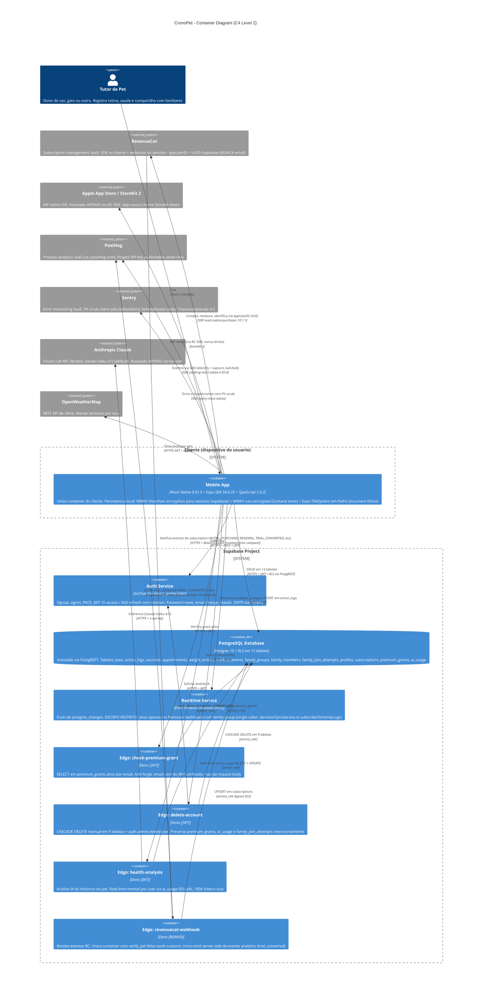

# Artefato 3 — C4 Container Diagram

**Notação:** C4 Container Diagram — Level 2 (Simon Brown — https://c4model.com/diagrams/container)
**Audiência:** CTO (referência permanente), devs novos em onboarding, auditor técnico
**Pergunta que responde:** Quais são os containers (deployment units) do sistema CronoPet, como eles se comunicam, onde estão os trust boundaries, e quais SaaS externos são acoplados
**Renderização:** este arquivo no GitHub renderiza Mermaid nativamente. Para apresentação tela-cheia, copiar bloco em https://mermaid.live
**Última atualização:** 2026-06-03
**Commit:** (este arquivo é parte do commit que o cria; hash em `git log -- docs/diagrams/03-architecture-c4-container.md`)
**Status:** approved

---

## Convenções

### Formas C4 canônicas (sintaxe Mermaid `C4Container`)

| Sintaxe | Significado |
|---|---|
| `Person(...)` | Ator humano (usuário do sistema) |
| `Container(...)` | Deployment unit (app, serviço, função) |
| `ContainerDb(...)` | Container que persiste dados (cilindro) |
| `System_Ext(...)` | Sistema externo (cinza) |
| `System_Boundary(...)` | Trust boundary (caixa tracejada) |
| `Rel(from, to, "verbo", "tecnologia")` | Relationship com label `verbo + tech` |

### Tags inline nos labels de Edge Functions

| Tag | Significado |
|---|---|
| `[JWT]` | `verify_jwt=true` no `supabase/config.toml` — exige JWT válido do GoTrue |
| `[BEARER]` | `verify_jwt=false` + Bearer custom (`REVENUECAT_WEBHOOK_AUTH_TOKEN`, constant-time compare) |

### Trust boundaries representados

1. **Cliente** — dispositivo do usuário (iOS/Android). Único container: Mobile App.
2. **Supabase Project** — projeto `qhbsmvuwuiupdqdrrdov.supabase.co`. 7 containers internos.
3. **External SaaS** — providers terceiros acessíveis via HTTPS. 6 systems.
4. **Wise USD** (fora-de-banda) — fluxo financeiro Apple→Wise→sócios, não atravessa nenhum container do app. Citado lateralmente.

### Cores (Mermaid C4 aplica padrão canônico)

- Pessoa: azul escuro
- Container interno (boundary do sistema em foco): azul médio
- ContainerDb: cilindro azul médio
- System_Ext: cinza
- Boundary: borda tracejada

Cor é redundante — todo container tem label textual.

---

## Diagrama C4 — Container Level 2



---

## Notas arquiteturais (lateral)

### N1 — Realtime ativo APENAS no Premium dashboard com family group

`services/SyncService.ts:242` (`subscribeToFamilyLogs`) é o único caller que cria canal `supabase.channel('cronopet-group-<id>')`. Caller direto: `app/premium.tsx:182`, com cleanup em `:170` (return do useEffect) e `:340` (signOut). Sem family group ou fora do Premium dashboard, **nenhuma conexão WSS é aberta**. Implicação: custo de Realtime escala apenas com adoção de family sharing.

### N2 — Acoplamento `services/purchases.ts` ↔ `store/usePetStore.ts`

Carry-over do Artefato 2. Em compra real, o evento `premium_purchase_completed` é disparado em 3 sites: `purchases.ts:245` (stub DEV), `purchases.ts:264` (handler imperativo) e `usePetStore.ts:1136` (callback de `customerInfoUpdateListener`). O acoplamento via listener cria possível duplicação. Já registrado em `docs/TODO.md` [P1].

### N3 — Wise USD: fluxo financeiro fora-de-banda

Apple/Google → Wise USD → conta dos sócios. **Não atravessa nenhum container do app**. Wise não tem acoplamento com Mobile App, Supabase, RevenueCat ou qualquer Edge Function. Mencionado para completude do mapa de receita, fora do escopo C4.

### N4 — RevenueCat usa appUserID = UUID Supabase, NÃO email (anti-PII)

`services/purchases.ts:124` `Purchases.configure({ apiKey, appUserID: userId })` + `:148` `Purchases.logIn(userId)`. `userId` vem de `data.user.id` do Supabase Auth (UUID v4 sintético). Email do usuário **nunca atravessa a fronteira para RevenueCat**. Decisão consciente: minimiza superfície de PII em SaaS terceiro.

### N5 — `check-premium-grant` extrai email do JWT, não do body (anti-forge)

`supabase/functions/check-premium-grant/index.ts:90-95`: `const { data: { user } } = await userClient.auth.getUser()` extrai email server-side do JWT assinado. Query subsequente `from('premium_grants').eq('email', user.email).eq('active', true)`. Atacante autenticado **não consegue** passar email de outro usuário via request body — o email não é lido do body.

### N6 — `delete-account` preserva 3 tabelas intencionalmente

`supabase/functions/delete-account/index.ts:124-150` deleta 9 tabelas + chama `auth.admin.deleteUser`. **NÃO toca em**:

- `premium_grants` — grant é por email (não user_id); preservar permite que o grant sobreviva se o usuário recriar a conta com mesmo email.
- `ai_usage` — rate-limit cross-account (impede recriar conta para resetar quota mensal de IA).
- `family_join_attempts` — audit trail anti-abuso.

Sem essa preservação, atacante poderia recriar conta com mesmo email para esquivar de cap de IA ou de rate-limit de tentativas de join.

---

## Lacunas conhecidas

### L1 — Supabase Storage NÃO usado

Confirmado por triangulação: zero ocorrências de `supabase.storage.from` em `app/`, `services/`, `lib/`, `store/`, `components/`. Fotos dos pets e das ações vivem em `Paths.document.uri` (Expo FileSystem) via helper `persistAndStripPhoto` em `store/usePetStore.ts:210`. **Storage não foi adicionado ao diagrama** por não ser parte da arquitetura real.

### L2 — Fotos sem sincronização cloud (descoberta do Artefato 3)

Implicação direta de L1: se o usuário trocar de celular ou reinstalar o app, **perde todas as fotos do pet**. Backup via iCloud do iOS pode mitigar mas não está garantido (sandbox path em `Paths.document` pode ou não estar incluído no backup, depende de configuração). Registrado em `docs/TODO.md` [P2]: avaliar Supabase Storage com bucket por user_id + RLS, base64 em Postgres, ou CDN terceiro.

### L3 — PostHog Personal API Key (phx_) preparado mas não em uso ativo

Existe localmente para uso futuro (server-side queries via Management API), mas nenhum container consome essa chave. Apenas a Project API Key (phc_, publishable) é usada — pelo Mobile App (SDK) e pelo `revenuecat-webhook` (capture HTTP direto).

### L4 — Sentry NÃO usado server-side via SDK

Edge Functions usam `console.error(JSON.stringify(...))` estruturado (visível em Supabase Dashboard → Functions → Logs). O SDK Sentry só roda no Mobile App. Trade-off consciente: evita peso extra de SDK em Deno + simplifica chave management (uma DSN a menos pra rotacionar).

---

## Fluxos principais (relationships detalhados)

### F1 — Onboarding e autenticação

```
Tutor -> Mobile App -> Auth Service (signup/PKCE) -> JWT armazenado em MMKV (Keychain)
Mobile App -> DB (INSERT em pets, profiles via PostgREST + RLS)
```

### F2 — Registro de ação cotidiana

```
Tutor -> Mobile App -> DB (INSERT em action_logs via PostgREST + JWT + RLS)
[se em family group + Premium dashboard aberto em outro device]
DB -> Realtime -> Mobile App (outro device) (WSS push de postgres_changes)
```

### F3 — Compra Premium (trial 7 dias)

```
Tutor -> Mobile App -> RC (purchasePackage via SDK) -> Apple StoreKit 2 -> RC valida -> Mobile App recebe customerInfo
[paralelamente, RC dispara webhook]
RC -> Edge: revenuecat-webhook (HTTPS + Bearer custom) -> DB (UPSERT subscriptions com service_role)
Mobile App -> PostHog (premium_purchase_started, premium_purchase_completed, trial_started via SDK)
```

### F4 — Conversão de trial (7 dias depois)

```
RC detecta TRIAL_CONVERTED -> Edge: revenuecat-webhook
Edge -> DB (UPDATE subscriptions)
Edge -> PostHog (trial_converted via capture HTTP direto, fire-and-forget)
```

`trial_converted` é o **único evento analytics emitido server-side**. Risco de silent miss documentado em `docs/TODO.md` [P2].

### F5 — Análise IA do pet

```
Tutor -> Mobile App -> Edge: health-analysis (HTTPS + JWT) com payload anonimizado
Edge -> DB (SELECT ai_usage para rate-limit; rejeita se >=50 calls/mes)
Edge -> Anthropic Claude (HTTPS + x-api-key, modelo claude-haiku-4-5)
Edge -> DB (UPDATE ai_usage)
Edge -> Mobile App (AnalysisResult)
```

Chave Anthropic vive APENAS em `Deno.env.get('ANTHROPIC_API_KEY')` — nunca é enviada ao cliente, nunca embarca no bundle EAS.

### F6 — Exclusão de conta (LGPD)

```
Tutor -> Mobile App -> Edge: delete-account (HTTPS + JWT)
Edge -> DB CASCADE DELETE em 9 tabelas (service_role)
Edge -> Auth Service (auth.admin.deleteUser, invalida JWT)
Edge -> Mobile App (ok: true)
Mobile App -> limpa MMKV + Keychain + FileSystem local
```

`premium_grants`, `ai_usage`, `family_join_attempts` preservados intencionalmente (ver N6).

---

## Referência canônica

Padrão C4 Container Diagram: https://c4model.com/diagrams/container

Definição oficial: "A Container diagram shows the high-level shape of the software architecture and how responsibilities are distributed across it. It also shows the major technology choices and how the containers communicate with one another."

Este artefato é Level 2 da hierarquia C4 (Context > Container > Component > Code). Level 1 (Context) está implícito no Person + System_Ext do diagrama. Level 3 (Component) intencionalmente fora de escopo (cada Edge Function ou tela do Mobile App seria seu próprio Component Diagram).
